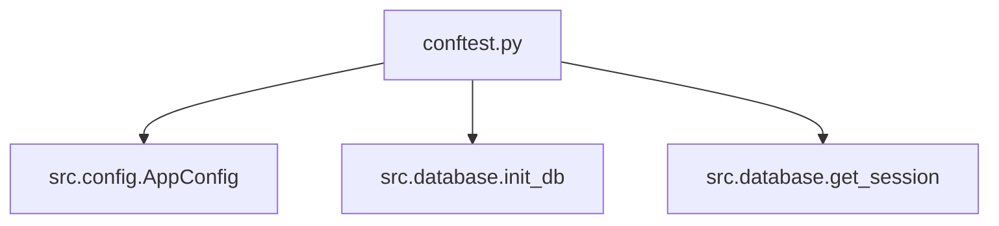

## Architecture Overview


## Components
### conftest.py
- Purpose: Provide pytest fixtures for testing
- Location: tests/conftest.py
- Dependencies:
  - src.config (AppConfig, load_config)
  - src.database (init_db, get_session)

## Interface Definitions

```python
def config() -> AppConfig:
    """Fixture providing a test AppConfig instance."""
```

```python
def db_engine(tmp_path) -> Engine:
    """Fixture providing an in-memory database engine."""
```

```python
@yield_fixture
def db_session(db_engine: Engine) -> Session:
    """Fixture providing a database session with cleanup."""
```

## Data Models

No new data models to create.

## File Changes

| Action | Path                | Description                                                                 |
|--------|---------------------|-----------------------------------------------------------------------------|
| MODIFY | tests/conftest.py    | Update imports and fixtures to match actual module exports                 |

## Test Strategy
1. Verify that all imports in conftest.py are correct.
2. Ensure config fixture returns a valid AppConfig instance.
3. Check that db_engine creates an in-memory database with tables initialized.
4. Confirm db_session provides isolated sessions with rollback cleanup.

## Implementation Order
1. Update imports in conftest.py to use actual exports from src/config and src/database.
2. Modify the config fixture to use load_config or construct AppConfig programmatically.
3. Implement db_engine fixture using init_db with :memory: path.
4. Implement db_session fixture using get_session and ensure cleanup.

## Risk Analysis
- **Risk**: Incorrect imports causing test failures.
  - Mitigation: Verify all imports match actual module exports.
- **Risk**: Test database not isolated between tests.
  - Mitigation: Use in-memory SQLite with session rollback.
- **Risk**: Fixtures not providing valid instances.
  - Mitigation: Add validation checks in test setup.