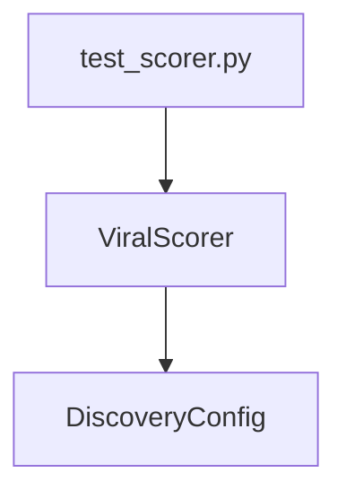

## Architecture Overview



## Components

### ViralScorer
- **Purpose**: Implements the viral score calculation algorithm using weighted sums of normalized metrics.
- **Location**: `src/discovery/scorer.py`
- **Dependencies**:
  - `DiscoveryConfig` from `src/config.py`

### DiscoveryConfig
- **Purpose**: Configuration model for discovery scoring weights and parameters.
- **Location**: `src/config.py`
- **Dependencies**:
  - Pydantic for validation

### Test Scorer Module
- **Purpose**: Unit tests for the ViralScorer class and its components.
- **Location**: `tests/test_scorer.py`
- **Dependencies**:
  - pytest fixtures
  - Mock data for video metrics

## Interface Definitions

```python
class ViralScorer:
    def __init__(self, config: DiscoveryConfig) -> None:
        """Initialize the ViralScorer with configuration weights.
        
        Args:
            config: Configuration containing scoring weights and parameters.
            
        Raises:
            ValueError: If sum of weights is not 1.0
        """
        self.weights = {
            'view_velocity': config.scoring.weight_view_velocity,
            'reddit_score': config.scoring.weight_reddit_score,
            'like_ratio': config.scoring.weight_like_ratio,
            'comment_velocity': config.scoring.weight_comment_velocity,
            'recency_factor': config.scoring.weight_recency_factor
        }
        
        if not isclose(sum(self.weights.values()), 1.0, rel_tol=1e-9):
            raise ValueError("Weights must sum to exactly 1.0")
            
    def calculate_score(self, video_data: dict) -> float:
        """Compute the viral score from video metrics.
        
        Args:
            video_data: Dictionary containing video metrics including:
                - view_velocity
                - reddit_score
                - likes
                - views
                - comments_per_hour
                - published_at
                
        Returns:
            Normalized score between 0.0 and 1.0
            
        Raises:
            KeyError: If required metric is missing
        """
        # Implementation details in data models section
```

## Data Models

### DiscoveryConfig
```python
class DiscoveryConfig(BaseModel):
    scoring: ScoringConfig
    
class ScoringConfig(BaseModel):
    weight_view_velocity: float = 0.25
    weight_reddit_score: float = 0.15
    weight_like_ratio: float = 0.20
    weight_comment_velocity: float = 0.20
    weight_recency_factor: float = 0.20
```

## File Changes

| Action | Path                     | Description                                                                 |
|--------|--------------------------|-----------------------------------------------------------------------------|
| CREATE | src/discovery/scorer.py  | Implement ViralScorer class with score calculation logic                    |
| CREATE | tests/test_scorer.py     | Unit tests for normalization functions and scoring algorithm                |

## Test Strategy

### Unit Tests
- `test_normalize_view_velocity`: Test log-scale normalization with various inputs including zero, small values, large values.
- `test_normalize_reddit_score`: Similar to above but for Reddit scores.
- `test_calculate_like_ratio`: Test edge cases like zero likes/views.
- `test_normalize_comment_velocity`: Test comment velocity normalization.
- `test_calculate_recency_factor`: Verify exponential decay curve.

### Integration Tests
- `test_full_scoring_pipeline`: Ensure all components work together correctly with sample video data.
- `test_zero_metrics`: Verify score is 0.0 when all metrics are zero.
- `test_max_values`: Test maximum possible score.

## Implementation Order

1. Create src/discovery/scorer.py
2. Implement normalization functions
3. Implement calculate_score method
4. Write tests in tests/test_scorer.py
5. Add test fixtures and mock data
6. Run tests to verify implementation

## Risk Analysis

### Potential Issues:
- **Division by zero**: Mitigated with careful handling in like ratio calculation.
- **Large values overflow**: Log-scale normalization prevents this.
- **Weight validation**: Enforced during initialization.

### Mitigations:
- Comprehensive test coverage for edge cases
- Proper input validation and error handling
- Configurable parameters to adjust normalization behavior