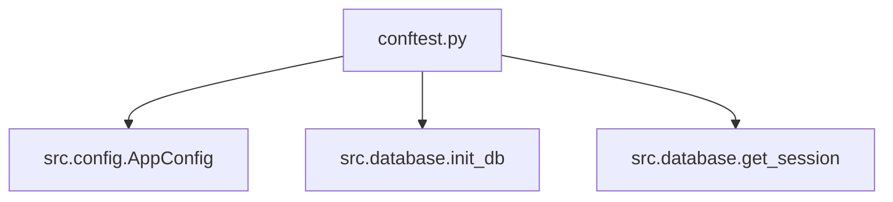

# Thinking Log — Design Phase

*Auto-generated by trading-agent. Captures LLM prompts, responses, and decision context for debugging and continuous learning.*

---

### Design Generation
**Timestamp**: 2026-02-28T23:54:18.023712+00:00
**Tokens**: 3,751 in / 979 out
**Duration**: 96.7s

<details>
<summary>System Prompt (424 est. tokens)</summary>

```
You are a senior software architect creating an implementation design.

Based on the specification, create a detailed DESIGN.md that:
1. Shows the architecture with component relationships
2. Defines interfaces and data models with actual code
3. Lists specific files to create/modify in a MACHINE-PARSEABLE table
4. Outlines a test strategy
5. Provides clear implementation order

CRITICAL: You MUST include a "## File Changes" section with this EXACT table format:

| Action | Path | Description |
|--------|------|-------------|
| CREATE | exact/file/path.py | What and why |
| MODIFY | exact/file/path.py | What changes |

The implement phase will parse this table. If it is missing or in a different
format, implementation will fail.

WORKSPACE RULES:
- Follow the coding standards and conventions provided in the workspace context
- PEP 8, type hints on all signatures, comprehensive docstrings
- Never hardcode secrets — use environment variables

LEARNING FROM PAST MISTAKES:
If the context contains a "Lessons from Previous Tasks" section, review it
carefully. These are documented failure patterns from earlier agent attempts.
Apply them when designing — e.g. reuse existing models instead of creating
new ones, specify EXACT file paths, and ensure interface definitions match.

Your design should be detailed enough that implementation is straightforward.
Include actual code signatures, not just descriptions.
Output ONLY the markdown document — no commentary, no fences.

```
</details>

<details>
<summary>User Prompt (4309 est. tokens)</summary>

```
## Task
# Task: Fix tests/conftest.py imports to match actual module exports

Priority: 1
Status: design-in-progress
Created: 2026-02-28T02:01:00Z
Scope: tests/conftest.py

## Description
The tests/conftest.py file was created during project scaffolding with placeholder
imports that do not match the actual implementations from Phase 0.

Current conftest.py contents:
\\\python
import pytest
from src.config import Config
from src.database import Database

@pytest.fixture
def config():
    return C

[... truncated — full prompt was 15,084 chars ...]
```
</details>

<details>
<summary>Raw Response (612 est. tokens)</summary>

```
```markdown
## Architecture Overview


## Components
### conftest.py
- Purpose: Provide pytest fixtures for testing
- Location: tests/conftest.py
- Dependencies:
  - src.config (AppConfig, load_config)
  - src.database (init_db, get_session)

## Interface Definitions

```python
def config() -> AppConfig:
    """Fixture providing a test AppConfig instance."""
```

```python
def db_engine(tmp_path) -> Engine:
    """Fixture providing an in-memory database engine."""
```

```python
@yield_fixture
def db_session(db_engine: Engine) -> Session:
    """Fixture providing a database session with cleanup."""
```

## Data Models

No new data models to create.

## File Changes

| Action | Path                | Description                                                                 |
|--------|---------------------|-----------------------------------------------------------------------------|
| MODIFY | tests/conftest.py    | Update imports and fixtures to match actual module exports                 |

## Test Strategy
1. Verify that all imports in conftest.py are correct.
2. Ensure config fixture returns a valid AppConfig instance.
3. Check that db_engine creates an in-memory database with tables initialized.
4. Confirm db_session provides isolated sessions with rollback cleanup.

## Implementation Order
1. Update imports in conftest.py to use actual exports from src/config and src/database.
2. Modify the config fixture to use load_config or construct AppConfig programmatically.
3. Implement db_engine fixture using init_db with :memory: path.
4. Implement db_session fixture using get_session and ensure cleanup.

## Risk Analysis
- **Risk**: Incorrect imports causing test failures.
  - Mitigation: Verify all imports match actual module exports.
- **Risk**: Test database not isolated between tests.
  - Mitigation: Use in-memory SQLite with session rollback.
- **Risk**: Fixtures not providing valid instances.
  - Mitigation: Add validation checks in test setup.
```
```
</details>

---

